# AI Debt Lens
 
AI Debt Lens is an explainable static analysis tool designed to detect and communicate technical debt introduced by AI-generated code. Built with React + Supabase, it analyzes AI-generated code risk, technical debt, and cognitive debt across GitHub repositories, uploaded files, and pasted code.
 
While AI-assisted programming tools accelerate development, they frequently produce code that is functionally correct but semantically weak, over-modularised, and architecturally misaligned — issues that existing tools fail to capture. AI Debt Lens combines AST-based structural analysis with AI-aware heuristics, deterministic scoring, hybrid AI verification, cognitive modeling, interactive dashboards, and history/reporting features into a single analysis workflow.
 
> Developed by **Team 1 SST LAB 2026** at the Indian Institute of Technology Tirupati (March 2026).
 
## Problem Statement
 
The rapid adoption of AI-assisted code generation tools such as GitHub Copilot, ChatGPT, and Cursor has introduced a new and largely unaddressed category of **AI-induced technical debt** — invisible to existing software quality tools.
 
Current tools are origin-agnostic: they treat all code equally and do not account for whether code was generated by a human or an AI system. As a result, there is no mechanism to:
 
- Identify which parts of a codebase are likely AI-generated
- Detect debt patterns specific to AI-generated code
- Quantify the additional cognitive and maintenance burden introduced
- Trace how such debt propagates through a system over time
AI Debt Lens directly targets this gap.
 
## Current Status
 
The project currently supports:
 
- Public GitHub repository analysis
- Single-file analysis through file upload
- Single-file analysis through pasted code
- Technical debt, cognitive debt, and AI-likelihood scoring
- File-level metric breakdowns and explanations
- Commit timeline analysis for GitHub repositories
- Propagation graph and hotspot views
- Refactor recommendations
- Downloadable reports
- Auth-backed analysis history
- In-app chatbot support
- Human cognitive model and developer cognitive simulation views
## Live Routes
 
These routes are currently wired in the app:
 
- `/` - landing page
- `/dashboard` - main analysis dashboard
- `/about` - project overview and metric context
- `/auth` - authentication
The repo also contains additional page files such as `FAQ`, `Features`, `Problem`, `Solution`, and `Contact`, but they are not currently mounted in `src/App.tsx`.
 
## Analysis Modes
 
### 1. GitHub Repository Analysis
 
Users can submit a public GitHub repository URL from the dashboard. The app calls Supabase Edge Functions to:
 
- fetch and inspect repository source files
- estimate AI-generated code likelihood
- calculate technical and cognitive debt
- produce file-by-file debt summaries
- build propagation and hotspot views
- fetch commit timeline debt trends
This is the main multi-file analysis path.
 
### 2. File Upload Analysis
 
Uploaded files are analyzed directly in the app using a deterministic local analyzer so metrics are available immediately, even if remote function calls are slow or unavailable.
 
### 3. Paste Code Analysis
 
Pasted code uses the same single-file local analysis path as upload, then optionally enriches the result with model-backed verification.
 
## Hybrid Scoring Pipeline
 
The project currently uses two different analysis paths:
 
### Repository Path
 
GitHub repository analysis is primarily handled by the `analyze-repo` Edge Function, with commit trend data coming from `analyze-commits`.
 
### Upload/Paste Path
 
Single-file analysis uses a hybrid pipeline:
 
1. Local deterministic heuristic analysis in `src/lib/localCodeAnalysis.ts`
2. AI verification through the `ai-detect` Edge Function
3. Cognitive calibration through the `human-cognitive-model` Edge Function
4. Blending and normalization in `src/lib/hybridAnalysis.ts` and `src/lib/analysisNormalization.ts`
This design keeps upload/paste analysis fast while improving score quality when model-backed signals are available.
 
## Metrics Tracked
 
The dashboard currently exposes:
 
- AI likelihood
- Technical debt
- Cognitive debt
- Propagation score
- Lines of code
- Function count
- Cyclomatic complexity
- Nesting depth
- AI debt contribution
It also computes derived metric families used in charts, tooltips, and file analysis panels, including:
 
- `TDS` - Technical Debt Score
- `CDS` - Cognitive Debt Score
- `CEB` - Cognitive Effort Burden
- `CU` - Comment Usefulness
- `FR` - Flow Readability / Flow Resilience style readability metric
- `DPS` - Debt Propagation Score
- `DLI` - Debt Longevity Index
- `CLI` - Cognitive Load Index
- `CCD` - Cognitive Complexity Drift
- `IAS` - Identifier Ambiguity Score
- `SUS` - Structural Uniformity Score
- `RI` - Readability Index
- `TDD` - Token Distribution Divergence
- `PRI` - Pattern Repetition Index
- `CRS` - Comment Redundancy Score
- `SCS` - Style Consistency Score
Additional internal/derived components such as `C`, `N`, `S`, `M`, and `D` are also used in the debt formulas.
 
## How the Single-File Heuristics Work
 
The local analyzer currently derives scores from signals such as:
 
- cyclomatic complexity
- nesting depth
- file size / LOC
- duplicate code
- token skew
- structural uniformity
- repeated patterns
- redundant comments
- generic naming
- formatting consistency
- readability proxies
These signals are then normalized so missing or sparse input payloads do not collapse debt metrics to zero.
 
## UI Modules in the Dashboard
 
The current dashboard includes:
 
- interactive code input with GitHub, upload, and paste modes
- animated progress and stage feedback
- metric summary cards
- file table with filtering and expandable details
- debt distribution charts
- AI detection radar
- debt DNA radar
- debt heatmap
- top-risk file breakdowns
- commit timeline
- refactor recommendations
- propagation graph
- deep analysis views
- report download
- history panel
## Human-Centered Analysis Features
 
The project includes dedicated cognitive and human-behavior analysis modules:
 
- `HumanCognitiveModel`
- `DeveloperCognitiveSimulation`
- `DatasetTrainer`
- `StarterDatasets`
The repo also contains support for training and inference workflows around custom cognitive models through Supabase functions.
 
## Supabase Edge Functions
 
Configured or present functions in the repo include:
 
- `analyze-repo` - core repository analysis pipeline; detects AI-specific structural patterns, computes ATDS, performs cognitive analysis, and builds the debt propagation graph
- `analyze-code` - single-file (paste/upload) analyzer using local deterministic heuristics for immediate metrics
- `analyze-commits` - commit timeline extraction, debt spike detection, developer contribution analysis, and trend prediction
- `ai-detect` - uses Gemini (LLM) to estimate AI-generated code probability and identify AI-generated segments
- `human-cognitive-model` - cognitive calibration and model-backed predictions; returns calibrated cognitive metrics blended with heuristics
- `train-cognitive-model` - cognitive classifier training workflow
- `cognitive-predict` - cognitive metric prediction helper
- `chatbot` - in-app chatbot support
- `improved-cognitive-predict` - enhanced prediction pipeline
- `improved-train-cognitive-model` - extended training workflow
- `model-validation` - model evaluation and validation
Note: `supabase/config.toml` currently lists the primary deployed analysis functions, while the repository contains some additional function directories for extended model/training workflows.
 
## Tech Stack
 
- React 18
- TypeScript
- Vite 5
- Tailwind CSS
- Framer Motion
- Radix UI
- TanStack Query
- Recharts
- React Router
- Supabase (PostgreSQL + Edge Functions)
- Google Gemini Flash (via Lovable AI Gateway)
- Vitest
## Project Structure
 
High-level areas of the project:
 
- `src/pages` - routed screens and dashboard entry points
- `src/components` - dashboard, charts, UX, and analysis presentation components
- `src/lib` - analysis logic, normalization, local heuristics, and hybrid scoring
- `src/integrations/supabase` - Supabase client and generated types
- `supabase/functions` - Edge Functions for repo analysis, AI detection, cognitive modeling, chatbot, and model workflows
- `supabase/migrations` - database schema and policy changes
## Environment Variables
 
The frontend currently expects:
 
```env
VITE_SUPABASE_URL=your_supabase_project_url
VITE_SUPABASE_PUBLISHABLE_KEY=your_supabase_publishable_key
```
 
Some Edge Functions also rely on Supabase server-side environment variables such as:
 
- `SUPABASE_URL`
- `SUPABASE_ANON_KEY`
The chatbot function additionally expects its own provider API key in the deployed environment.
 
## Getting Started
 
### Install
 
```bash
npm install
```
 
### Run Development Server
 
```bash
npm run dev
```
 
### Build
 
```bash
npm run build
```
 
### Preview Production Build
 
```bash
npm run preview
```
 
### Run Tests
 
```bash
npm run test
```
 
## Available Scripts
 
- `npm run dev`
- `npm run build`
- `npm run build:dev`
- `npm run lint`
- `npm run preview`
- `npm run test`
- `npm run test:watch`
## Data and Persistence
 
The app currently stores authenticated user analysis history in Supabase through the `analysis_history` table.
 
There is also chatbot-related persistence in Supabase migrations, including:
 
- `chatbot_knowledge`
- `chatbot_cache`
## Current Limitations
 
- Repository analysis is still more heuristic-heavy than single-file hybrid enrichment.
- Upload and paste analysis are strongest for single-file workflows, not full project architecture inference.
- Some page components exist in the repo but are not currently routed.
- Advanced model-training functions are present in the repo, but not all are necessarily part of the default deployed path.
## Recommended Use
 
Use the project this way for the best current results:
 
- Analyze a GitHub repository when you want project-wide hotspots and commit trends.
- Upload or paste a file when you want faster, more reliable single-file debt metrics.
- Use the file table, radar charts, and deep analysis views together for the clearest picture of AI-induced and human-maintainability debt.
## Team
 
**Team 1 — IIT Tirupati**
 
| Member | Roll No. | Role |
|---|---|---|
| Aditya Puvanthala Rajesh | cs24b003 | Backend + AI Pipeline + Integration Lead |
| Nandini Goud | cs24b008 | Cognitive Debt + Metrics Design |
| Rudresh Prasad | cs24b034 | Propagation Engine + Graph Modeling |
| Vottikalla Santhosh | cs24b050 | AI Detection + Heuristics + Scoring |
| Maan Kamble | cs24b023 | Frontend + UI/UX Development |
 
## Summary
 
AI Debt Lens is currently a hybrid code analysis dashboard focused on one core question:
 
How much technical debt and cognitive debt is being introduced, especially in code that may be AI-generated?
 
The present implementation already includes strict AI detection signals, normalized debt scoring, hybrid single-file analysis, history tracking, deep cognitive views, and interactive visualizations that make the results easier to inspect and act on.

## Pictures

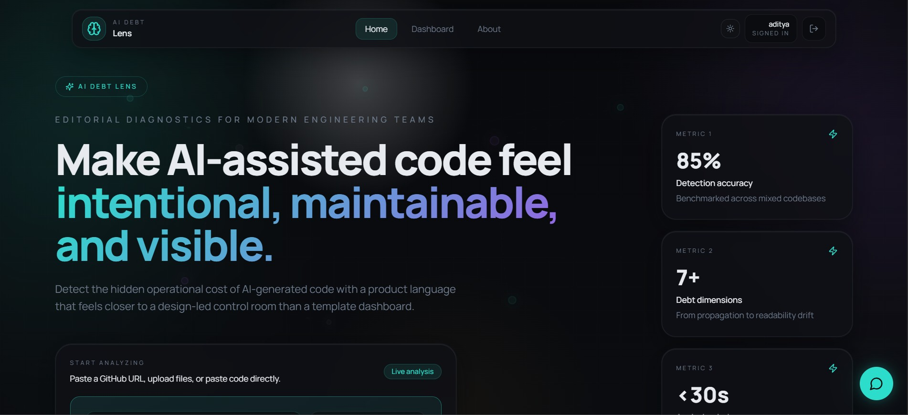
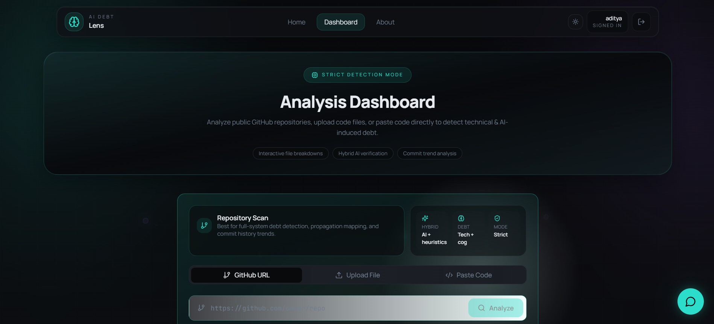
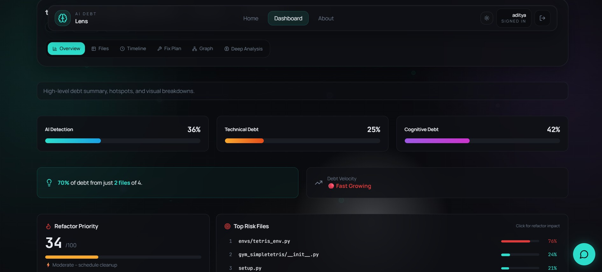
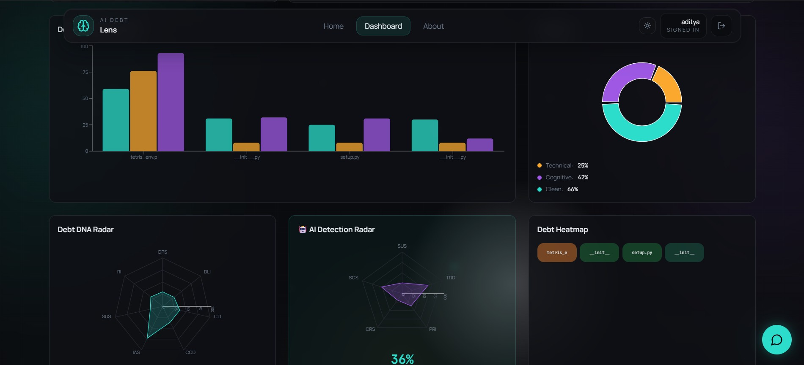
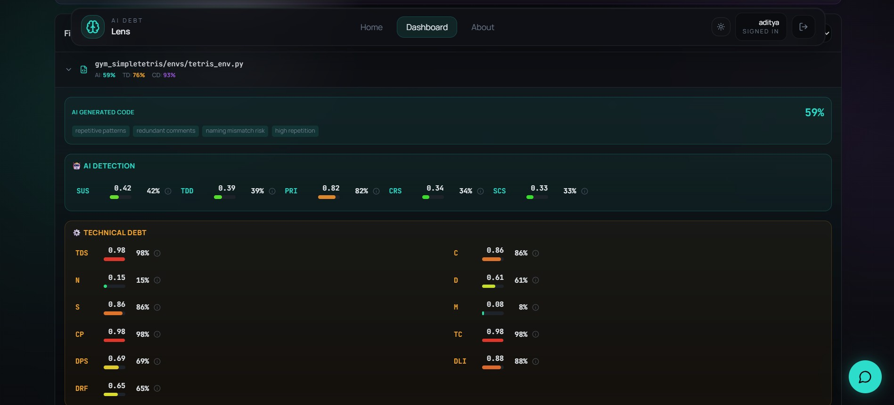
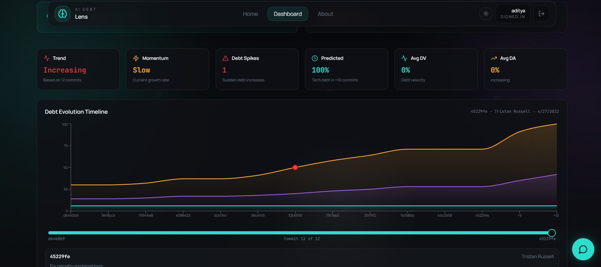
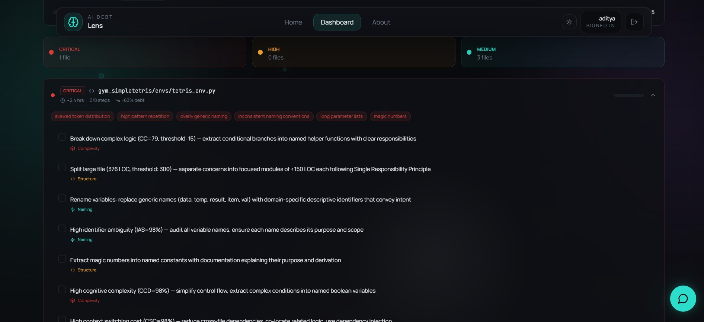
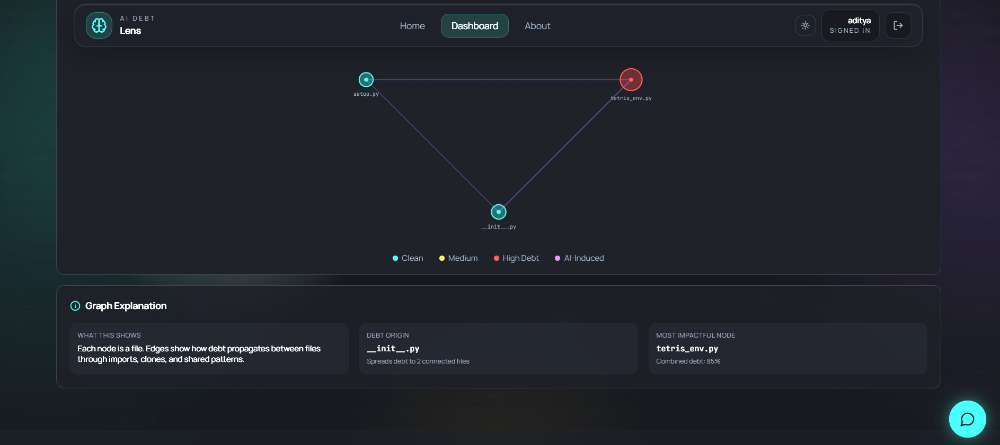
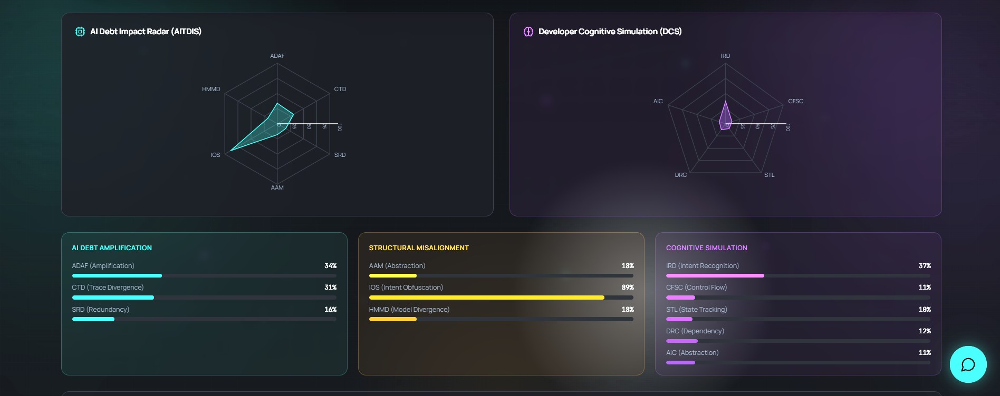
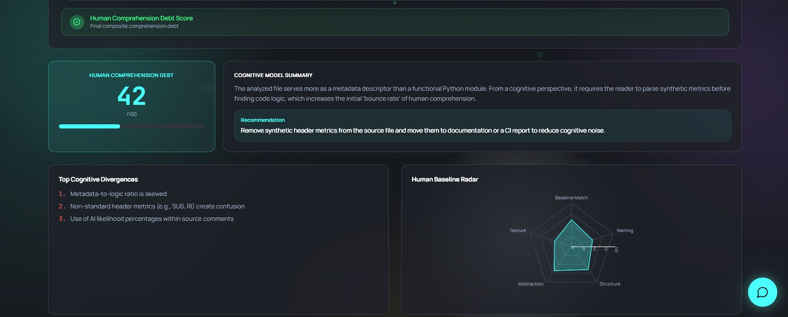
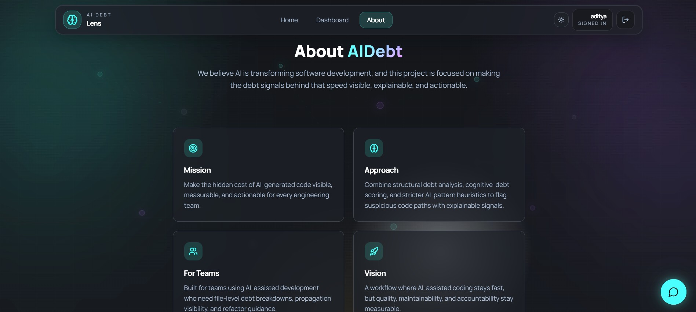
